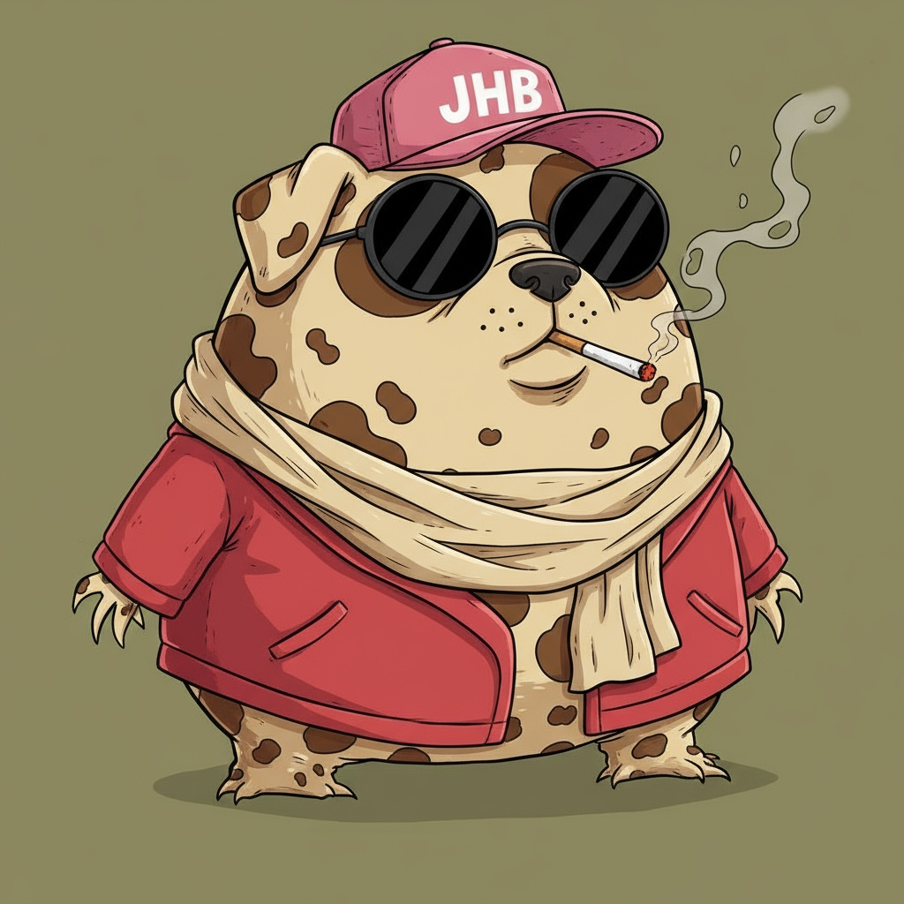

  
  

  

    <strong>Desenvolvedor Full-Stack focado na criação de ferramentas práticas, SaaS e automações.</strong> 
    <em>Building the future with good vibes and clean code. ⚡ ("Vibecode" mindset)</em>
  

 

## 🚀 Sobre mim

Olá! Sou o **Luiz**, um desenvolvedor com uma forte veia empreendedora. Meu foco principal está em construir **soluções que resolvem problemas reais e possuem potencial de mercado**. Gosto de trabalhar em todo o ciclo de desenvolvimento, desde o frontend responsivo (geralmente com uma estética Cyberpunk moderna) até integrações robustas no backend.

- 🏗️ **Arquitetura & Projetos:** Especialista em criar ferramentas SaaS (como sistemas de filas em tempo real para barbearias), catálogos B2B e bots de Trading avançados.
- 🤖 **Automação & IA:** Experiência no desenvolvimento de bots baseados em múltiplos agentes e integrações com IA.
- 🎨 **Minha Marca:** Costumo identificar meus projetos profissionais com o ecossistema **"Zeta"** (ex: *Zeta Barbershop*, *Zeta Store*), garantindo um padrão de alta qualidade e uma identidade visual forte e imersiva.

---

## 💻 Tech Stack & Ferramentas

Minha stack principal foca em performance, escalabilidade e desenvolvimento ágil:

### **Frontend & Design**

  
  
  
  

### **Backend, Banco de Dados & Infra**

  
  
  

### **Scripts, Bots & IA**

  
  

---

## 📊 Analytics do GitHub

  
  

 

## 📫 Vamos Conectar?

Estou sempre aberto a discutir novas ideias, arquiteturas de software e oportunidades de negócios.

- **X:** [https://x.com/luizfuzeta](#)
- **Email:** [fuzetacel@gmail.com)

 

  <em>"Transformando ideias complexas em interfaces elegantes e código funcional."</em> ⚡

