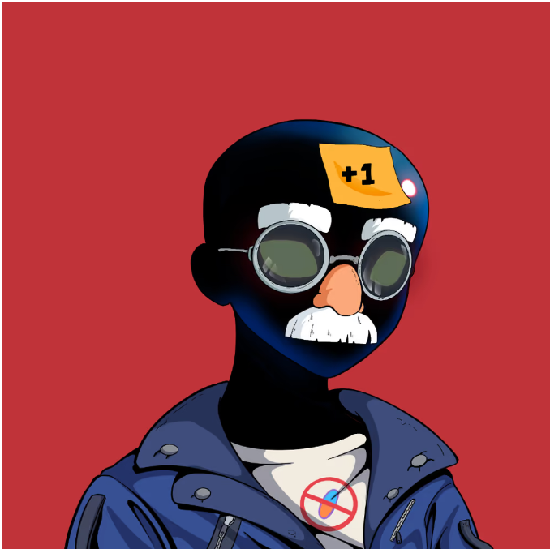

  
  

  

    <strong>Desenvolvedor Full-Stack e criador de ferramentas internas para negócios reais.</strong> 
    <em>Sistemas que resolvem o problema do dia e continuam funcionando no próximo ano.</em>
  

## Sobre mim

Sou o Luiz, dono da MLF Dutos e criador do ecossistema **Zeta Company** — ferramentas que construí para rodar a minha própria operação, e que valem tanto para outras empresas quanto para a minha.

Meu caminho é rápido sem fugir de responsabilidade: quando um sistema pode mitigar o risco, eu mitigo; quando precisa ser simples para eu usar de verdade, eu simplifico. Procuro sempre a versão mais **funcional, simples e barata** que ainda se sustenta em uso real — e evito construir tecnicamente bonito mas financeiramente infavorável.

- **Sistemas financeiros críticos**: Sistema interno com **vales, pagamentos semanais e recebimentos** dos funcionários (Next.js + Supabase na nuvem). Regras de dinheiro vivem no banco, com lock transacional e auditoria ledger (`numeric(12,2)` nunca virou float).
- **Orçamentos para obras (estimativa sobre projeto de engenharia)**: o Zeta Orçamentos lê projetos DXF/DWG de HVAC, calcula quantitativos preliminares e entrega orçamento comercial em PDF — a partir da geometria original, sem IA que "inventa" medida.
- **Gestão para assistências técnicas (OzFix)**: ordem de serviço mobile-first, estoque, recibos e rastreio — desde o balcão até o financeiro.
- **Ferramentas de IA e automação**: uso agentes de IA (Claude Code, Codex, GLM, OpenCode, Antigravity) como equipe, coordenados por um agente supervisor. Construo caminhos de dados seguros cada vez que uso: log de decisão e gate humano antes de qualquer escrita importante.

O que muda em relação à maioria dos devs: eu **uso de verdade** o que construo — cada ferramenta acima roda a minha operação. Isso me força a fazer funcional hoje, não "genérico pra amanhã".

## Ferramentas & Stack

**Frontend / Design**

**Backend / Banco / Infra**

**Bots / Automação / IA**

## Projetos Zeta Company

| Sistema | O que faz | Status |
|---|---|---|
| **Zeta Orçamentos** | Orçamento comercial gerado a partir do próprio projeto (DXF/DWG, quantitativos, PDF) | Em produção comercial |
| **Norte Trading Desk** | Mesa pessoal de pesquisa e gestão de risco em Hyperliquid (simulação, motor em prova) | Em pesquisa |
| **OF Finance Tool** | Organizador financeiro para renda variável (núcleo local e auditável) | Em descoberta |
| **O Porquê das Coisas** | Canal de vídeos curtos explicando IA com time multiagente e verificação factual | Arquitetura aprovada |
| **Zeta Funcionários** | Vales, presença e pagamentos semanais do time — WhatsApp manual, RLS, gestão financeira | Em produção |
| **OzFix** | Gestão de ordens de serviço para assistência técnica mobile-first | Em beta |
| **Zeta Stack** | Orquestração local de serviços de IA: Claude, Codex, GLM, escritas canônicas, gate de custo | Em evolução |
| **Trincheiras Solana** | Pesquisa de padrões em lançamentos de memecoins (análise de fluxo de carteiras) | Em pesquisa |

## Analytics do GitHub

  
  

## Contato

- **X:** [x.com/luizfuzeta](https://x.com/luizfuzeta)
- **Email:** [fuzetacel@gmail.com](mailto:fuzetacel@gmail.com)

  <em>"A ferramenta boa resolve o problema de hoje sem criar dívida para amanhã."</em>

